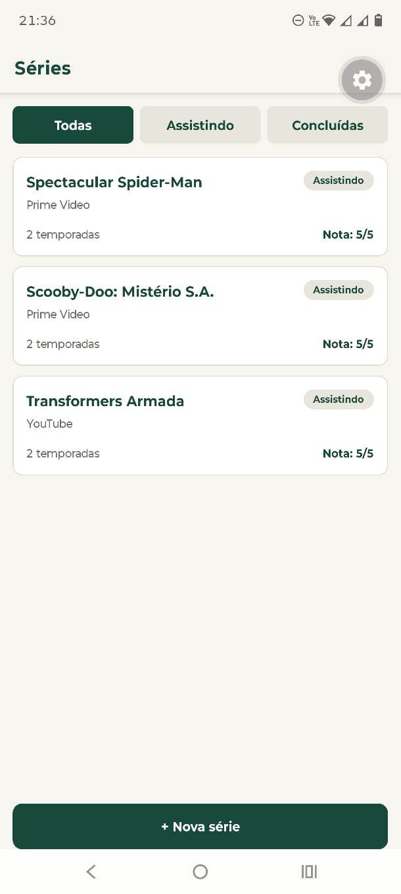
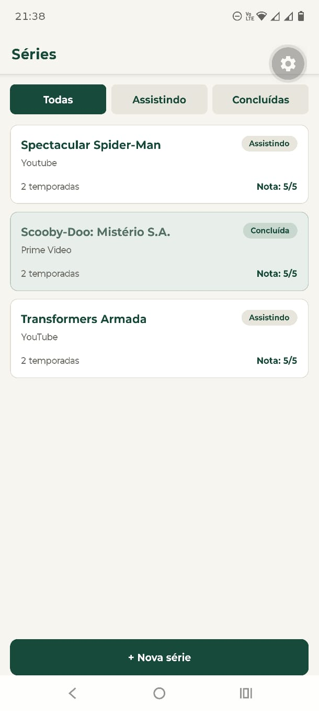
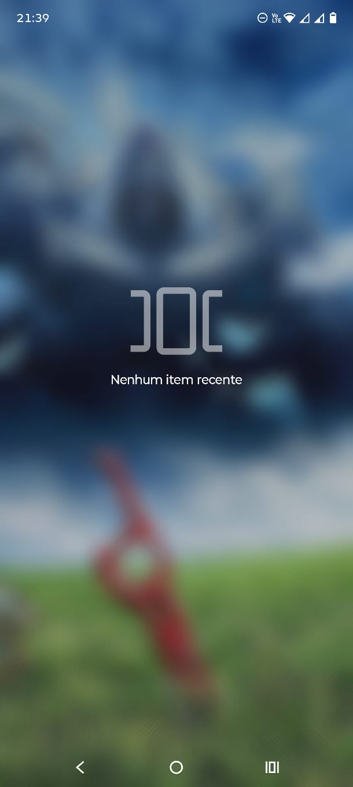
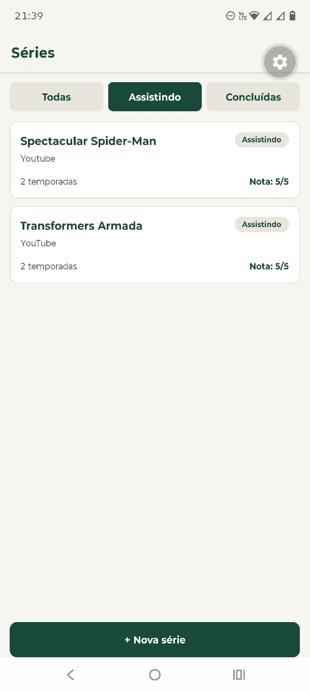

# Séries

 Aplicativo mobile para cadastro e acompanhamento de séries, desenvolvido como projeto acadêmico utilizando React Native, Expo, Expo Router, TypeScript, NativeWind e SQLite.

 O aplicativo permite cadastrar séries, acompanhar quais estão sendo assistidas, marcar séries como concluídas, adicionar notas, editar informações e excluir registros.

 ## Funcionalidades

 - Cadastro de séries.
- Listagem de todas as séries cadastradas.
- Filtro por:
  - Todas
  - Assistindo
  - Concluídas
- Visualização dos detalhes de uma série.
- Edição de séries.
- Marcação de série como concluída ou em andamento.
- Exclusão de séries com confirmação.
- Nota de 1 a 5 estrelas.
- Persistência dos dados localmente com SQLite.
- Datas de cadastro armazenadas em formato ISO 8601.

 ## Tecnologias

- React Native
- Expo
- Expo Router
- TypeScript
- NativeWind
- Expo SQLite

 ## Como rodar

 Clone o repositório e instale as dependências:

```
npm install
```

 Depois, inicie o projeto:

```
npx expo start
```

 A partir do Expo, o aplicativo pode ser executado em um dispositivo físico ou em um emulador Android/iOS.

 ## Persistência — Etapa 8

 O teste de persistência foi realizado para verificar se os dados das séries permanecem armazenados mesmo após o aplicativo ser fechado e reaberto.

 As imagens abaixo documentam as etapas do teste.

 ### 1\. Séries cadastradas

 A primeira imagem mostra a tela inicial com as séries cadastradas no aplicativo. Nesse momento, os registros já foram criados e estão sendo exibidos normalmente na lista.

 

 ### 2\. Séries editadas

 Nesta etapa, algumas informações das séries foram alteradas utilizando a tela de edição. A imagem demonstra que as alterações foram aplicadas e aparecem na lista.

 

 ### 3\. Aplicativo fechado

 Após realizar os cadastros e alterações, o aplicativo foi fechado. Esta imagem registra o estado do teste antes de abrir novamente o aplicativo.

 

 ### 4\. Dados preservados após reabrir

 O aplicativo foi aberto novamente e as séries continuaram disponíveis. Isso demonstra que os dados não dependem apenas do estado em memória da aplicação e foram persistidos no banco SQLite.

 

 ### 5\. Filtro funcionando após a persistência

 Por fim, foi utilizado o filtro da lista para verificar se os dados persistidos continuam sendo consultados e filtrados corretamente. A imagem demonstra o funcionamento do filtro entre as séries cadastradas.

 

 Os arquivos utilizados nas evidências estão organizados em:

```
docs/
└── testePersistencia/
    ├── 01-series-criadas.png
    ├── 02-series-editadas.png
    ├── 03-app-fechado.png
    ├── 04-series-persistidas.png
    └── 05-filtro-funcionando.png
```

 ## Diário do copiloto

 ### Registro 1 — Modelagem da entidade

 **O que eu pedi:** como estruturar os tipos TypeScript para a entidade `Serie`, considerando os campos do banco SQLite.

 **O que a IA sugeriu (resumo):** criar uma interface `Serie` com todos os campos persistidos e separar os tipos `CreateSerieInput` e `UpdateSerieInput`. Também foi criado o tipo `SerieFilter` para representar os filtros disponíveis.

 **O que eu fiz:** aceitei e adaptei. A principal adaptação foi manter `concluida` como `number`, porque no SQLite esse campo é armazenado como `INTEGER` com os valores `0` e `1`, em vez de utilizar `boolean`.

 ### Registro 2 — Repository e consultas SQL

 **O que eu pedi:** como implementar o repository de séries seguindo o padrão utilizado anteriormente no repository de notas.

 **O que a IA sugeriu (resumo):** criar funções separadas para listar, buscar por ID, cadastrar, atualizar, alternar o status de conclusão e excluir séries. Para os filtros, sugeriu realizar a filtragem diretamente no SQL utilizando `WHERE`.

 **O que eu fiz:** aceitei e revisei as queries. Mantive os valores variáveis utilizando `?`, evitando montar SQL com valores diretamente na string.

 ### Registro 3 — Filtro de séries

 **O que eu pedi:** como fazer o filtro de séries concluídas e em andamento.

 **O que a IA sugeriu (resumo):** usar `WHERE concluida = ?` no SQL, passando `0` para séries em andamento e `1` para séries concluídas. Para "todas", utilizar a consulta sem `WHERE`.

 **O que eu fiz:** aceitei, porque essa solução atende ao requisito de fazer o filtro no banco e evita buscar todas as séries para depois utilizar `.filter()` no JavaScript.

 ### Registro 4 — useFocusEffect

 **O que eu pedi:** por que o `useEffect(() => { carregar(); }, [])` não é suficiente quando volto do formulário para a lista e como fazer a lista atualizar nesse caso.

 **O que a IA sugeriu (resumo):** utilizar o `useFocusEffect` do Expo Router. Diferentemente do `useEffect` com array vazio, ele permite executar uma função quando a tela recebe foco novamente. A IA também explicou que a função passada para `useFocusEffect` deve ser envolvida em `useCallback`, evitando criar uma nova função a cada renderização.

 **O que eu fiz:** aceitei e apliquei na tela de lista. Também utilizei o `useFocusEffect` na tela de detalhes para recarregar os dados quando retorno da edição.

 **O que eu aprendi:** a tela de lista não necessariamente é desmontada quando navego para o formulário. Ela permanece na pilha de navegação. Por isso, o `useEffect` com `[]` não executa novamente quando volto para a lista. O `useFocusEffect` é adequado para situações em que preciso executar novamente uma ação quando a tela volta a receber foco.

 ### Registro 5 — NativeWind e área segura

 **O que eu pedi:** ajuda para estilizar as telas utilizando NativeWind e resolver um problema em que o botão "+ Nova série" ficava sobreposto à barra de navegação do Android.

 **O que a IA sugeriu (resumo):** configurar o NativeWind corretamente, incluindo o `global.css` no `_layout.tsx`, e utilizar `SafeAreaView`. Para o botão, sugeriu removê-lo do posicionamento `absolute` e colocá-lo no fluxo normal da tela.

 **O que eu fiz:** aceitei as alterações. Durante o teste, descobri que o principal problema da falta de estilização era o `global.css` não estar importado no `_layout.tsx`. Também alterei o posicionamento do botão para evitar a sobreposição com a área de navegação do Android.

 ### Registro 6 — Correção de uma sugestão da IA

 **O que eu pedi:** ajuda para configurar e utilizar o SQLite no projeto.

 **O que a IA sugeriu (resumo):** inicialmente foram consideradas abordagens que poderiam utilizar APIs diferentes da versão atual do `expo-sqlite`.

 **O que eu fiz:** rejeitei/adaptei a sugestão e mantive a API utilizada no projeto, com `openDatabaseAsync`, `getAllAsync`, `getFirstAsync` e `runAsync`.

 **Por que:** o projeto utiliza a API atual do `expo-sqlite` e não deveria voltar para a API antiga baseada em `openDatabase` e `transaction`.